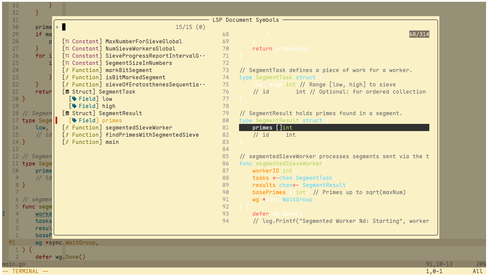

# vanilla and sane config for neovim

giga minimal neovim config for programmers with sane defaults, native lsp, treesitter, and completion, with a modern touch of `oil`, `fzf-lua`, `fidget`, and `typst-preview`



## requirements

- neovim 0.12+, tree-sitter
- git, fzf, rg, fd, bat, delta, chafa
- **lua, luajit**, lua-language-server
- **c, llvm, clang**, clangd
- **go**, gopls
- **rust**, rust-analyzer
- **python**, pyright
- **typescript, node**, typescript-language-server
- **java, jdk**, jdtls
- **csharp**, csharp-ls
- **typst**, tinymist
- **docker**, docker-language-server, compose-language-service
- yaml-language-server, tombi
- codebook-lsp

## update all dependencies one liner

### windows

```bash
npm update -g && yarn global upgrade && gup update && cargo install-update -a && scoop update -a && winget upgrade --all -u
```

## references

- <https://neovim.io/doc/user/lsp.html#lsp-config>
- <https://gpanders.com/blog/whats-new-in-neovim-0-11/>
- <https://www.youtube.com/watch?v=xGkL2N8w0H4>

## keymap

<details>
    <summary>...more</summary>

`<leader>` key is set to `Space`.

### General & Custom Keybinds

These are top-level custom mappings for various actions within Neovim.

| Mode | Keybinding | Action |
| :--- | :--- | :--- |
| Normal | `-` | Opens the parent directory in `oil.nvim`. |
| Normal | `<leader>q` | Quits current window (e.g. quickfix window). |
| Normal | `<leader>x` | Save and source. |
| Normal | `<leader>p` | Toggles the `typst-preview` window. |
| Normal | `<leader>u` | Triggers an update for installed packages. |
| Normal | `[<Space>` | Adds an empty line above the cursor. |
| Normal | `]<Space>` | Adds an empty line below the cursor. |

### List & Buffer Navigation

These keymaps help navigate through various Vim lists like quickfix, buffers, and more.

| Mode | Keybinding | Action |
| :--- | :--- | :--- |
| **Quickfix List** | | |
| Normal | `[q` / `]q` | Navigate previous/next in the quickfix list. |
| Normal | `[Q` / `]Q` | Jump to the first/last entry in the quickfix list. |
| Normal | `[CTRL-Q` / `]CTRL-Q`| Navigate previous/next in the quickfix list. |
| **Location List** | | |
| Normal | `[l` / `]l` | Navigate previous/next in the location list. |
| Normal | `[L` / `]L` | Jump to the first/last entry in the location list. |
| Normal | `[CTRL-L` / `]CTRL-L`| Navigate previous/next in the location list. |
| **Other Lists** | | |
| Normal | `[b` / `]b` | Navigate to the previous/next buffer. |
| Normal | `[B` / `]B` | Jump to the first/last buffer. |
| Normal | `[a` / `]a` | Navigate the argument list. |
| Normal | `[t` / `]t` | Navigate the tag matchlist. |

### Language Server Protocol (LSP) & Diagnostics

This table combines the default LSP keybindings with custom mappings for a complete overview of language-aware features.

| Mode | Keybinding | Action |
| :--- | :--- | :--- |
| Normal | `<leader>b` | Formats the current buffer. |
| Insert | `<C-Space>` | Manually triggers completion suggestions. |
| Normal | `grn` | Rename the symbol under the cursor. |
| Normal | `grr` | List references for the symbol under the cursor. |
| Normal | `gri` | Go to the implementation of the symbol. |
| Normal | `gO` | Show a table of contents (document symbols). |
| Normal, Visual | `gra` | Show available code actions. |
| Insert, Select | `CTRL-S` | Show signature help for the current function call. |
| Normal | `[d` | Move to the previous diagnostic in the buffer. |
| Normal | `]d` | Move to the next diagnostic in the buffer. |
| Normal | `[D` | Jump to the first diagnostic in the buffer. |
| Normal | `]D` | Jump to the last diagnostic in the buffer. |

### Oil.nvim (File Explorer)

The following are the **default** keybindings available when an `oil.nvim` buffer is active.

| Mode | Keybinding | Action |
| :--- | :--- | :--- |
| Normal | `<CR>` | Select and open the file or directory. |
| Normal | `<C-s>` | Open the selection in a vertical split. |
| Normal | `<C-h>` | Open the selection in a horizontal split. |
| Normal | `<C-t>` | Open the selection in a new tab. |
| Normal | `<C-p>` | Preview the file. |
| Normal | `<C-c>` | Close the oil buffer. |
| Normal | `<C-l>` | Refresh the directory listing. |
| Normal | `-` | Go to the parent directory. |
| Normal | `_` | Open a new oil buffer in the current working directory. |
| Normal | `` ` `` | Change Neovim's directory to the current oil directory. |
| Normal | `g?` | Show help for oil actions. |
| Normal | `gs` | Change the sorting method (by name, size, etc.). |
| Normal | `gx` | Open the selected file with its default external program. |
| Normal | `g.` | Toggle the visibility of hidden files. |
| Normal | `g\` | Toggle whether to move files to the system trash. |

### FZF-Lua Keybinds

have configured `fzf-lua` for searching files, git history, LSP features, and more.

| Mode | Keybinding | Action |
| :--- | :--- | :--- |
| **General** | | |
| Normal | `<leader>e` | Global search across various sources. |
| Normal | `<leader>n` | Combined search (files, buffers, etc.). |
| Normal | `<leader>/` | Grep for a pattern in the current buffer. |
| Normal | `<leader>z` | Live grep across project. |
| Normal | `<leader>f` | Search for files by name. |
| Normal | `<leader>h` | Search help tags. |
| Normal | `<leader>k` | Search available keymaps. |
| Normal | `<leader>l` | Search the location list. |
| Normal | `<leader>m` | Search marks. |
| Normal | `<leader>t` | Search the quickfix list. |
| **Git** | | |
| Normal | `<leader>gf` | Search through Git files in the current repository. |
| Normal | `<leader>gs` | Show Git status. |
| Normal | `<leader>gd` | Show Git diff. |
| Normal | `<leader>gh` | Search through Git hunks. |
| Normal | `<leader>gc` | Search through Git commits. |
| Normal | `<leader>gl` | View Git blame for the current file. |
| Normal | `<leader>gb` | Search and switch between Git branches. |
| Normal | `<leader>gt` | Search Git tags. |
| Normal | `<leader>gk` | Search Git stash. |
| **LSP (via FZF)** | | |
| Normal | `<leader>\\` | General LSP finder. |
| Normal | `<leader>d` | Show diagnostics for the current document. |
| Normal | `<leader>'` | Show diagnostics for the entire workspace. |
| Normal | `<leader>,` | Find incoming calls for the symbol under the cursor. |
| Normal | `<leader>.` | Find outgoing calls for the symbol under the cursor. |
| Normal | `<leader>a` | List and execute LSP code actions. |
| Normal | `<leader>s` | Show symbols in the current document. |
| Normal | `<leader>w` | Live search for symbols across the workspace. |
| Normal | `<leader>r` | Find references to the symbol under the cursor. |
| Normal | `<leader>i` | Find implementations of the symbol under the cursor. |
| Normal | `<leader>o` | Go to the type definition of the symbol under the cursor. |
| Normal | `<leader>j` | Go to the definition of the symbol under the cursor. |
| Normal | `<leader>v` | Go to the declaration of the symbol under the cursor. |

</details>
